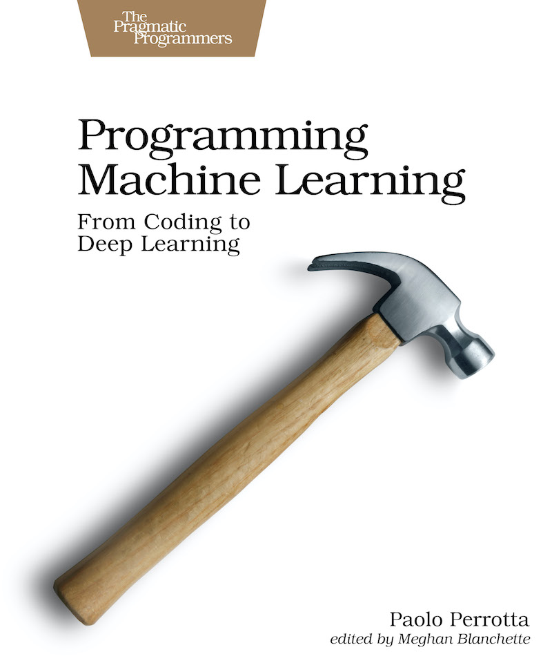

Hi there! I'm Paolo Perrotta, and this is the companion site to [Programming Machine Learning](https://pragprog.com/book/pplearn). It contains all the explanations that I couldn't cram in the book.

_If you came here, chances are you followed a link from the book's latest beta. Here's the plan (as of January 16): I just started working on this site, right after sending the book through the final production stages. The book should take a couple of months to get to the printers, and during that time, I'll write the missing content on Medium, and link it from this page. Please come back later! (And mail me at paolo.nusco.perrotta@gmail.com if you need to contact me in the meantime.)_
